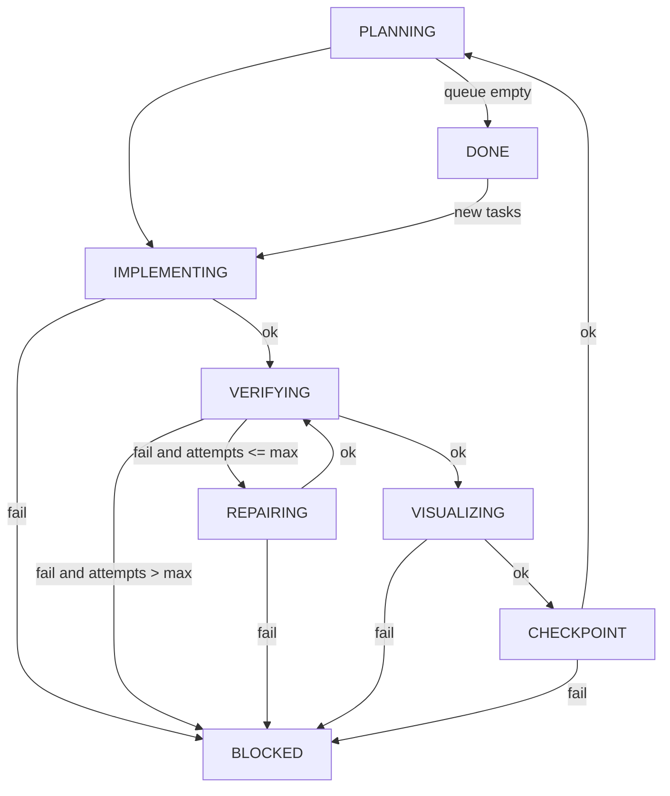

# longrun-agent

A pure, sequential long-running workflow engine for Codex-driven development.

This repository is intentionally focused on long-running task execution only.
All visual plugin code has been removed.

For Chinese documentation, see [README.zh-CN.md](./README.zh-CN.md).

## Overview

`longrun-agent` runs a JSONL queue through a deterministic state machine.

Core capabilities:

1. Queue-driven execution (`ops/queue.jsonl`)
2. Durable runner state (`ops/state.json`)
3. Hook-based automation (`planning`, `implement`, `verify`, `repair`, `visualize`, `checkpoint`)
4. Auto-repair loop when verification fails
5. Step metrics (`durationMs`, `tokensUsed`, cumulative totals)
6. Optional git checkpoint commit per task

## State Machine



Task status transitions:

- `PENDING -> IN_PROGRESS`
- `IN_PROGRESS -> COMPLETED`
- `IN_PROGRESS -> BLOCKED`

## Project Layout

```text
.
├── README.md
├── README.zh-CN.md
├── package.json
├── scripts/
│   └── longrun/
│       ├── init.mjs
│       ├── enqueue.mjs
│       ├── configure.mjs
│       ├── run-once.mjs
│       ├── run-forever.mjs
│       ├── status.mjs
│       ├── report.mjs
│       ├── unblock.mjs
│       └── lib.mjs
└── LICENSE
```

`ops/` is runtime state generated by `longrun:init` and ignored by git.

## Quick Start (New Long-Running Project)

1. Create working directories:

```bash
WORKDIR=$(mktemp -d /tmp/my-longrun-work-XXXXXX)
ARTDIR=$(mktemp -d /tmp/my-longrun-artifacts-XXXXXX)
```

2. Initialize:

```bash
npm run longrun:init -- --force --workdir "$WORKDIR" --artifacts-dir "$ARTDIR"
```

3. Enqueue tasks:

```bash
npm run longrun:enqueue -- "Task title" --priority P1 --acceptance "Expected result" --prompt "What Codex should do"
```

4. Run continuously:

```bash
npm run longrun:run -- --interval 20
```

## Runtime Commands

```bash
npm run longrun:status
npm run longrun:report -- --since 24h --until now
npm run longrun:run-once
npm run longrun:unblock -- --to-in-progress --phase VERIFYING
```

## Hooks

Configure hooks for automation:

```bash
npm run longrun:configure -- \
  --implement 'codex exec "{{task_prompt}}" > "{{task_artifacts_dir}}/implement.log" 2>&1' \
  --verify 'npm test --if-present > "{{task_artifacts_dir}}/verify.log" 2>&1' \
  --repair 'codex exec "Fix {{task_artifacts_dir}}/verify.log" > "{{task_artifacts_dir}}/repair.log" 2>&1'
```

Template vars include:

- `{{task_id}}`, `{{task_title}}`, `{{task_prompt}}`, `{{task_acceptance}}`
- `{{workdir}}`, `{{artifacts_dir}}`, `{{task_artifacts_dir}}`
- `{{queue_path}}`, `{{plan_path}}`, `{{phase}}`

## Git Behavior

- `longrun:init` runs `git init` in `workdir` by default (`--git-init false` to disable).
- Default `checkpoint` hook stages and commits changes if there are staged diffs.
- Default commit message: `checkpoint(TXXXX): auto snapshot`.

## License

MIT
