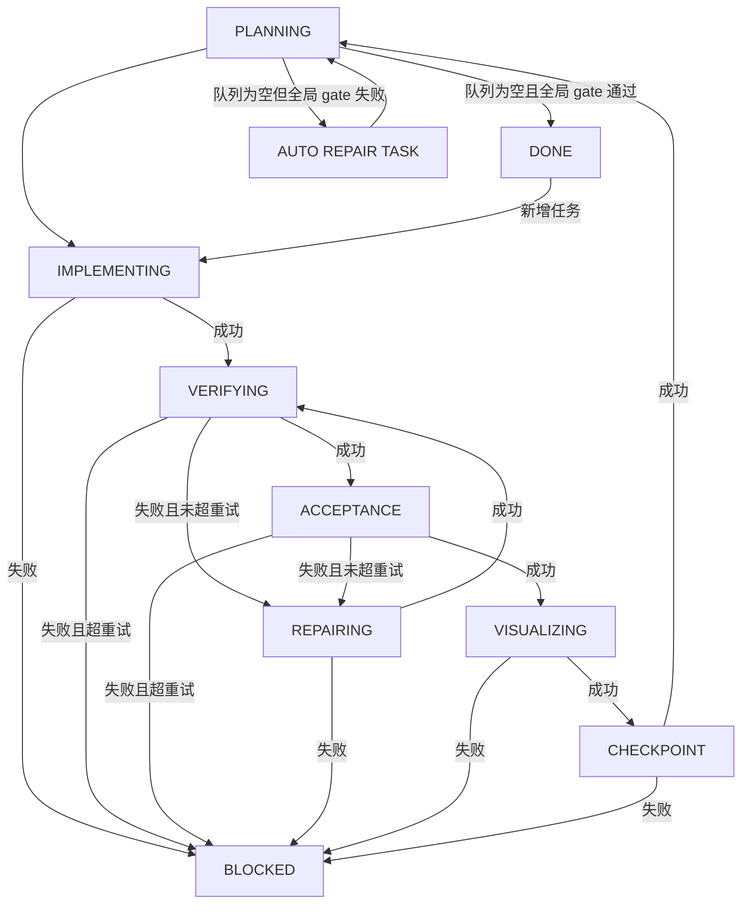

# longrun-agent（中文）

一个纯粹的、串行执行的 Codex 长任务引擎。

这个仓库现在只保留 long running 相关能力，已经移除了所有 plugin 代码。

英文文档见 [README.md](./README.md)。

## 概览

`longrun-agent` 基于任务队列和状态机运行。

核心能力：

1. 队列驱动执行（`ops/queue.jsonl`）
2. 持久化运行状态（`ops/state.json`）
3. phase hook 自动化（`initPlanning/planning/implement/verify/acceptance/repair/visualize/checkpoint/globalAcceptance`）
4. verify 或 acceptance 失败自动进入 repair 重试
5. 步骤级统计（耗时、token、累计值）
6. checkpoint 自动 git 提交（可选）
7. 任务级/全局级硬性验收 gates

## 完整状态流转



任务状态流转：

- `PENDING -> IN_PROGRESS`
- `IN_PROGRESS -> COMPLETED`
- `IN_PROGRESS -> BLOCKED`

## 目录结构

```text
.
├── README.md
├── README.zh-CN.md
├── package.json
├── scripts/
│   └── longrun/
│       ├── init.mjs
│       ├── enqueue.mjs
│       ├── configure.mjs
│       ├── run-once.mjs
│       ├── run-forever.mjs
│       ├── status.mjs
│       ├── report.mjs
│       ├── unblock.mjs
│       └── lib.mjs
└── LICENSE
```

`ops/` 是运行时目录，由 `longrun:init` 自动生成，且已加入 git ignore。

## 从零启动一个新项目

1. 创建目录：

```bash
WORKDIR=$(mktemp -d /tmp/my-longrun-work-XXXXXX)
ARTDIR=$(mktemp -d /tmp/my-longrun-artifacts-XXXXXX)
```

2. 初始化：

```bash
npm run longrun:init -- --force --workdir "$WORKDIR" --artifacts-dir "$ARTDIR"
```

3. 入队：

```bash
npm run longrun:enqueue -- "任务标题" --priority P1 --acceptance "验收标准" --prompt "给 Codex 的执行指令"
```

4. 持续运行：

```bash
npm run longrun:run -- --interval 20
```

## 一键启动（任意任务）

```bash
npm run longrun:bootstrap:task -- \
  --requirement "你的任务需求描述" \
  --decompose codex \
  --start-runner false
```

`--max-tasks` 是可选参数；不传表示不限制分解任务数。

然后启动 runner：

```bash
npm run longrun:run -- --interval 20
```

## 常用命令

```bash
npm run longrun:status
npm run longrun:report -- --since 24h --until now
npm run longrun:run-once
npm run longrun:unblock -- --to-in-progress --phase VERIFYING
```

## Hook 配置

```bash
npm run longrun:configure -- \
  --init-planning 'codex exec "读取 {{prompt_path}} 并分解任务写入 {{queue_path}}" > "{{artifacts_dir}}/_initPlanning.log" 2>&1' \
  --implement 'codex exec "{{task_prompt}}" > "{{task_artifacts_dir}}/implement.log" 2>&1' \
  --verify 'npm test --if-present > "{{task_artifacts_dir}}/verify.log" 2>&1' \
  --acceptance 'bash scripts/acceptance.sh > "{{task_artifacts_dir}}/acceptance.log" 2>&1' \
  --globalAcceptance 'bash scripts/global-gate.sh > "{{artifacts_dir}}/_global/verify.log" 2>&1' \
  --repair 'codex exec "Fix {{task_artifacts_dir}}/verify.log" > "{{task_artifacts_dir}}/repair.log" 2>&1'
```

如果 prompt 里可能出现反引号或 `$()`，建议先把 prompt 写入文件，再用 `$(cat "$PROMPT_FILE")` 传给 `codex exec`，避免被 shell 误执行。

`initPlanning` 只会在“队列为空且 `initPlanningDone=false`”时触发一次。可通过下面命令重置：

```bash
npm run longrun:configure -- --reset-init-planning true
```

可用模板变量：

- `{{task_id}}`, `{{task_title}}`, `{{task_prompt}}`, `{{task_acceptance}}`
- `{{workdir}}`, `{{artifacts_dir}}`, `{{task_artifacts_dir}}`
- `{{queue_path}}`, `{{plan_path}}`, `{{prompt_path}}`, `{{phase}}`

## 硬性验收 Gates

任务级 gate（`longrun:enqueue`）：

```bash
npm run longrun:enqueue -- "任务标题" \
  --prompt "..." \
  --acceptance "..." \
  --acceptance-cmd "pnpm -r test --if-present" \
  --required-files "packages/ts-cli/src/index.ts,packages/ts-tui/src/index.ts" \
  --forbid-patterns "not yet implemented,TODO\\(critical\\)" \
  --required-test-packages "packages/ts-cli,packages/ts-tui" \
  --min-test-files 10 \
  --min-test-cases 100 \
  --fail-on-no-tests true
```

全局 gate（队列空时执行）：

```bash
npm run longrun:configure -- \
  --global-acceptance-cmd 'pnpm -r test --if-present > "{{artifacts_dir}}/_global/verify.log" 2>&1' \
  --global-required-files "final-report.md" \
  --global-forbid-patterns "not yet implemented" \
  --global-required-test-packages "packages/ts-cli,packages/ts-tui" \
  --global-min-test-cases 150 \
  --global-fail-on-no-tests true
```

## Git 行为

- `longrun:init` 默认在 `workdir` 执行 `git init`（可 `--git-init false` 关闭）。
- 默认 `checkpoint` 会在有改动时自动提交。
- 默认 commit msg 会根据任务信息和 staged diff 摘要自动生成。

## License

MIT
